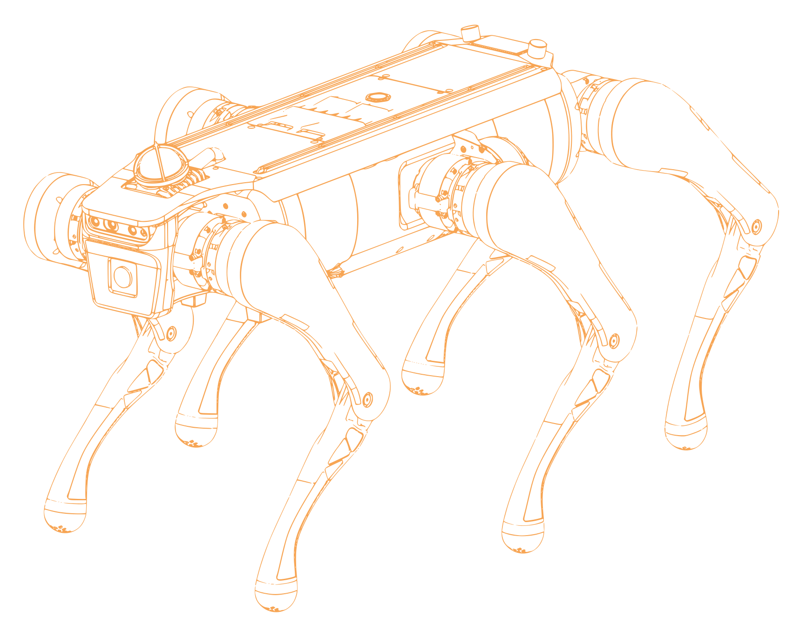
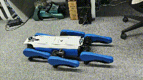
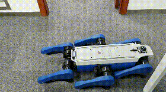
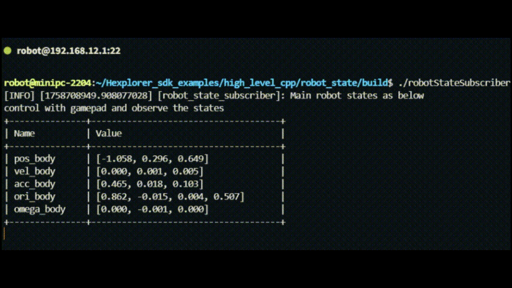
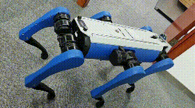
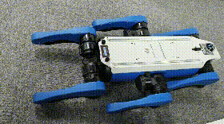

<p align="center">
  
</p>

<p align="center">
  
</p>

<p align="center">
  <a href="./README_zh.md">
    
  </a>
  <a href="./LICENSE">
    
  </a>
  <a href="https://www.dobot-robots.com/products">
    
  </a>
</p>

This repository contains the joint motor SDK and secondary development example programs for the **Dobot Hexplorer hexapod robot**. It includes three high-level control examples, two joint-level control examples and the demo programs of lidar and realsense camera.

Supported model: **miniHex_v2**

**Preparation**:

```bash
source /opt/ros/humble/setup.bash
source ~/robot_controller_release/ros2_packages/setup.bash
```

## High-Level Control Examples

Enter high level directory and compile:

```bash
mkdir build && cd build
cmake ..
make
```

Run the program:

```bash
./<executable file>
```

If you want to run the Python examples, go to the `py` directory and execute:

```bash
python3 <example file>.py
```

Normally, you should see the following cases (from left to right):

- Body twist demo
- Locomotion demo
- Robot state console output
- Robot state real test

<div align="center">
<table>
  <tr>
    <td align="center">
      <br>
      <b>body_twist</b>
    </td>
    <td align="center">
      <br>
      <b>locomotion</b>
    </td>
  </tr>
  <tr>
    <td align="center">
      <br>
      <b>robot_state console output</b>
    </td>
    <td align="center">
      <br>
      <b>robot_state real test</b>
    </td>
  </tr>
</table>
</div>

## Joint Control Examples

These examples demonstrate how to communicate with the joint motors via the robot interface API,
including reading and sending data from/to the joint motors.

**Build**

```bash
cd motor_sdk/
mkdir build && cd build
cmake ..
make
```

**Stop existing control programs**

To avoid conflicts with the auto-start control program, first kill the `start_controller.sh` and `main` processes:

```bash
ps -ef | grep start_controller.sh
sudo kill <process ID>
ps -ef | grep main
sudo kill <process ID>
```

**Run**

```bash
cd build
./motor_read miniHex_v2
./motor_wave miniHex_v2
```

<div align="center">
  <br>
  <b>motor_wave</b>
</div>

## Livox LiDAR

First, you need to start the LiDAR node. Please make sure to run the command on **intel-minipc** instead of jetson-nano:

```bash
sudo chmod +x ros2_setup.bash
./ros2_setup.bash
ros2 launch livox_lidar_node start_node.launch.py
```

You can verify whether the node has started successfully with `ros2 topic list`.

**Build**

```bash
cd livox
mkdir build && cd build
cmake ..
make
```

**Run**

```bash
<executable file>  # C++ method, or
python3 ./py/<script file>  # Python method
```

If the program runs correctly, you should see console output showing the point cloud frame rate (10 Hz), number of points, and related IMU information.

---

## Realsense Camera

First, you need to start the depth camera node. Please make sure to run the command on **jetson-nano** instead of intel-minipc:

```bash
ssh robot@192.168.1.20  # password: 123
cd Hexplorer_sdk_examples
sudo chmod +x ros2_setup.bash
./ros2_setup.bash
ros2 launch realsense_camera_node start_node.launch.py
```

You can verify whether the node has started successfully with `ros2 topic list`.

**Build**

```bash
cd realsense
mkdir build && cd build
cmake ..
make
```

**Run**

```bash
<executable file>  # C++ method, or
python3 ./py/<script file>  # Python method
```

If the program runs correctly, you should see console output showing the camera frame rate (30 Hz), resolution, and other information.
