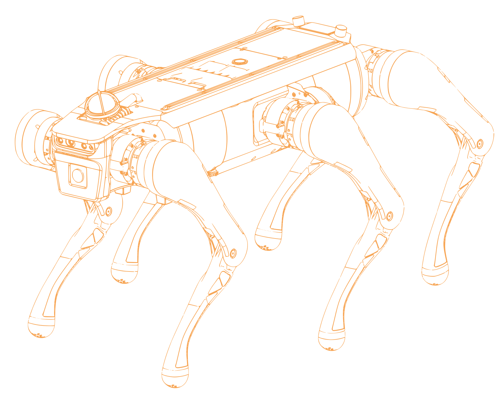
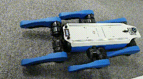

<p align="center">
  
</p>

<p align="center">
  
</p>

本仓库为 Dobot Hexplorer 六足机器人的关节电机 SDK 及关节控制案例程序。

支持型号：miniHex_v2

📖 **二次开发文档**——运控接口、激光雷达、深度相机、电机接口、系统升级——见 [wiki.md](./wiki.md)。

## 关节控制示例

案例程序主要展示通过 robot interface api 与关节电机进行通信，包括从关节电机读取数据和发送数据。

**编译**

```bash
cd motor_sdk/
mkdir build && cd build
cmake ..
make
```

**停止控制程序**

防止自启动的控制程序与关节控制程序产生冲突，需要先将`start_controller.sh`和`main`进程杀掉

```bash
ps -ef | grep start_controller.sh
sudo kill <progress ID>
ps -ef | grep main
sudo kill <progress ID>
```

**运行**

```bash
cd build
./motor_read miniHex_v2
./motor_wave miniHex_v2
```

<div align="center">
  <br>
  <b>motor_wave</b>
</div>
