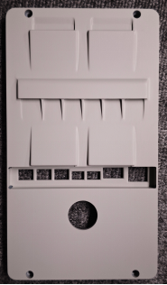
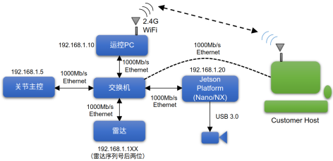

# Hexplorer 二次开发文档

> Dobot Hexplorer 六足机器人（miniHex_v2）二次开发接口说明，涵盖开发环境、网络访问、运控接口、传感器接口、电机接口与系统升级方法。

## 目录

- [OS 与开发环境](#os-与开发环境)
- [网络与访问](#网络与访问)
- [控制系统与 SDK](#控制系统与-sdk)
  - [运控接口](#运控接口)
  - [雷达与深度相机](#雷达与深度相机)
  - [电机控制接口](#电机控制接口)
- [系统升级方法](#系统升级方法)

---

## OS 与开发环境

Hexplorer 探索者采用双计算平台：

| 平台                         | CPU                                        | RAM   | ROM        | 备注             |
| ---------------------------- | ------------------------------------------ | ----- | ---------- | ---------------- |
| 运动控制平台（Intel MiniPC） | i7/i5 酷睿，标称主频 1.2 GHz，6 核 16 线程 | 16 GB | 可用 95 GB | —                |
| 算力平台（Jetson Orin Nano） | Arm 6XA789                                 | 8 GB  | 128 GB     | GPU 算力 40 TOPS |

操作系统为 Ubuntu 22.04，预装 ROS2 Humble。系统中预装 C/C++、Python (3.10)、miniconda、docker、程序编译与虚拟开发调试环境。

### 用户接口板

<p align="center">
  
</p>

从右往左依次是：

1. Ethernet 网口，连接到内部交换机
2. HDMI 接口，连接 jetson nano
3. Type-C 接口，连接 jetson nano
4. Type-C 接口，连接 intel minipc
5. 电源接口，提供 12V/2A 电源
6. 电源接口，提供 24V/3A 电源
7. 电源接口，提供 48V/5A 电源

---

## 网络与访问

### 内部网络拓扑结构

<p align="center">
  
</p>

### 访问终端

#### 有线连接

使用网线连接机器背部板的网口：

```bash
# minipc
ssh robot@192.168.1.10  # 密码 123
# nano
ssh robot@192.168.1.20  # 密码 123
```

#### 无线连接

Wi-Fi 连接 minipc 发布的 AP 热点，热点名字为 `YJ-MiniHexV2-xxx`（xxx 为机器型号），密码为 `1234abcd`。

```bash
# minipc
ssh robot@192.168.12.1  # 密码 123
```

### 连接外网

在minipc上执行`./start_wifi.sh`

```bash
./start_wifi.sh "<SSID>" "<PASSWORD>"
```

---

## 控制系统与 SDK

所有程序都位于 `~/robot_controller_release` 下.

minipc 上该目录包含：

- `executable`：主控程序、标定文件、日志记录、配置文件、工具脚本
- `ros2_packages`：livox mid360s/mid360 驱动、realsense camera 驱动、机器人 urdf 文件等
- `third_party`：机器人主控程序依赖的第三方库
- `version.txt`：控制器版本信息
- `setup.sh`：环境变量设置脚本

jetson nano 上该目录包含：

- `ros2_packages`：livox mid360s/mid360 驱动、realsense camera 驱动、机器人 urdf 文件等
- `version.txt`：控制器版本信息

> ⚠️ 上述两台设备 `~/robot_controller_release` 目录下的子目录和文件请勿删除或修改。若因擅自修改导致系统运行异常，请联系技术支持人员重置系统。

### 运控接口

当主控程序正常运行时，用户可以看到如下 ROS2 话题：

```bash
/joy
/joy/set_feedback
/parameter_events
/robot_cmd
/robot_detection_cmd
/robot_grf_x
/robot_state
/rosout
/vel_cmd
```

#### /robot_state

```bash
source ~/robot_controller_release/ros2_packages/setup.bash
ros2 topic echo /robot_state
```

数据格式说明：

| 数据名               | 说明                                                 |
| -------------------- | ---------------------------------------------------- |
| header               | 时间戳、坐标系等                                     |
| control_cmd          | 控制命令                                             |
| jtau_leg             | 腿部关节力矩                                         |
| jvel_leg             | 腿部关节速度                                         |
| jpos_leg             | 腿部关节位置                                         |
| jtau_leg_des         | 腿部关节目标力矩                                     |
| jvel_leg_des         | 腿部关节目标速度                                     |
| jpos_leg_des         | 腿部关节目标位置                                     |
| jpower_leg           | 腿部关节功率                                         |
| jpos_cmd_leg         | 腿部关节位置命令                                     |
| jtau_arm             | 手臂关节力矩                                         |
| jvel_arm             | 手臂关节速度                                         |
| jpos_arm             | 手臂关节位置                                         |
| jtau_total           | 关节总力矩                                           |
| jpower_total         | 关节总功率                                           |
| pos_body             | 身体实时位置，排列顺序 (x,y,z)，单位 m               |
| vel_body             | 身体实时速度，排列顺序 (x,y,z)，单位 m/s             |
| acc_body             | 身体实时加速度，排列顺序 (x,y,z)，单位 m/s²          |
| ori_body             | 身体实时姿态，四元数格式 (w,x,y,z)                   |
| omega_body           | 世界坐标系下身体角速度，排列顺序 (x,y,z)，单位 rad/s |
| pos_foot_left        | 双足用，左侧足端位置                                 |
| pos_foot_right       | 双足用，右侧足端位置                                 |
| vel_foot_left        | 双足用，左侧足端速度                                 |
| vel_foot_right       | 双足用，右侧足端速度                                 |
| grf_left             | 双足用，左侧足端反馈力                               |
| grf_right            | 双足用，右侧足端反馈力                               |
| rf_vertical_filtered | 双足用，FZ                                           |
| temp                 | 复用数组，各下标含义见下表                           |

`temp` 数组：

| 下标     | 说明                                                                       |
| -------- | -------------------------------------------------------------------------- |
| temp[3]  | grf_x_total                                                                |
| temp[4]  | battery 0 的 soc                                                           |
| temp[5]  | battery 1 的 soc                                                           |
| temp[6]  | battery 0 的电流                                                           |
| temp[7]  | battery 1 的电流                                                           |
| temp[8]  | battery 0 的电压                                                           |
| temp[9]  | battery 1 的电压                                                           |
| temp[10] | 机器人运行状态：0.passive 1.standDown 2.standUp 3.balanceStand 4.Walk 5.RL |

#### /robot_cmd

```bash
source ~/robot_controller_release/ros2_packages/setup.bash
ros2 topic pub -1 /robot_cmd custom_msg/msg/RobotCommand "{target_state: 0}"
```

数据格式说明：

| 数据名       | 说明                                                                           |
| ------------ | ------------------------------------------------------------------------------ |
| header       | 时间戳、坐标系等                                                               |
| target_state | 机器人运行切换模式：0.passive 1.standDown 2.standUp 3.balanceStand 4.Walk 5.RL |

- 如果在状态 1 想让机器人进入站立状态，设置 target_state 为 2，机器人在站起来之后会自动进入 3 balanceStand 状态
- 如果在状态 3 想让机器人趴下，设置 target_state 为 1

#### /vel_cmd

需要先让机器人进入 walk 状态或者 RL 状态。

```bash
source ~/robot_controller_release/ros2_packages/setup.bash
ros2 topic pub -1 /vel_cmd geometry_msgs/msg/Twist "{linear: {x: 0.1, y: 0.0, z: 0.0}, angular: {x: 0.0, y: 0.0, z: 0.1}}"
```

数据格式说明：

| 数据名    | 说明                            |
| --------- | ------------------------------- |
| linear.x  | 机器人 X 方向的线速度，单位 m/s |
| linear.y  | 机器人 Y 方向的线速度，单位 m/s |
| angular.z | 机器人偏航角速度，单位 rad/s    |

### 雷达与深度相机

#### livox mid360(s)

机器狗预装了 livox mid360 或者 livox mid360s 激光雷达，其驱动已安装到 `~/robot_controller_release/ros2_packages/`。

##### 雷达 IP 与 host_ip 设置

```bash
# livox mid360
vim ~/robot_controller_release/ros2_packages/livox_ros_driver2/share/livox_ros_driver2/config/MID360_config.json
# livox mid360s
vim ~/robot_controller_release/ros2_packages/livox_ros_driver2/share/livox_ros_driver2/config/MID360s_config.json
```

- 若当前设备是 nano，则设置 `host_ip` 为 `192.168.1.20`；若当前设备是 minipc，则设置 `host_ip` 为 `192.168.1.10`。
- `lidar_configs` 中的 ip 设置为 `192.168.1.1xx`，其中 xx 是雷达序列码的后两位；雷达序列码位于雷达背后的二维码下方。

##### 启动雷达

雷达可以在 minipc 或者 nano 上启动，两者启动方式相同，建议在 nano 上使用：

```bash
ssh robot@192.168.1.20
source ~/robot_controller_release/ros2_packages/setup.bash
ros2 launch livox_ros_driver2 msg_MID360_launch.py
```

##### 订阅消息

雷达启动后发布三个话题：

| 话题         | 类型                                                        | 说明                                   |
| ------------ | ----------------------------------------------------------- | -------------------------------------- |
| /livox/lidar | `sensor_msgs/msg/PointCloud2` 或 `custom_msg/msg/CustomMsg` | 雷达点云数据                           |
| /livox/imu   | `sensor_msgs/msg/Imu`                                       | 雷达 IMU 数据                          |
| /tf_static   | `tf2_msgs/msg/TFMessage`                                    | 静态坐标系变换，包含雷达的安装位姿信息 |

雷达默认发布 `sensor_msgs/msg/PointCloud2` 类型的消息，可以直接订阅。若需要使用 `custom_msg/msg/CustomMsg` 类型的消息，请修改配置文件：

```bash
vim ~/robot_controller_release/ros2_packages/livox_ros_driver2/share/livox_ros_driver2/config/lidar_publish_config.json
```

将其中 `is_custom_pointcloud` 改为 `True` 后重新发布。注意此时订阅前需要先执行 `source ~/robot_controller_release/ros2_packages/setup.bash`。

#### realsense d435

##### 启动节点

深度相机只能在 jetson nano 上启动：

```bash
ssh robot@192.168.1.20
source ~/robot_controller_release/ros2_packages/setup.bash
ros2 launch realsense_camera_node start_node.launch.py
```

##### 订阅消息

深度相机启动后发布四个话题：

| 话题                                       | 类型                         | 说明                                   |
| ------------------------------------------ | ---------------------------- | -------------------------------------- |
| /realsense_camera_node/camera_info         | `sensor_msgs/msg/CameraInfo` | 相机内参                               |
| /realsense_camera_node/color/bgr/image_raw | `sensor_msgs/msg/Image`      | 彩色图像                               |
| /realsense_camera_node/depth/u16/image_raw | `sensor_msgs/msg/Image`      | 深度图像                               |
| /tf_static                                 | `tf2_msgs/msg/TFMessage`     | 静态坐标系变换，包含相机的安装位姿信息 |

### 电机控制接口

使用 motor_sdk 之前请务必先杀死板载的主控程序，避免与 motor_sdk 冲突：

```bash
ps -ef | grep start_controller.sh
sudo kill -9 <pid>
ps -ef | grep main
sudo kill -9 <pid>

ps -ef | grep main  # 验证是否成功杀死 ./main miniHex2 进程
```

电机的控制程序与电机状态的读取案例程序请参考本仓库 `motor_sdk/example`。

---

## 系统升级方法

升级包命名规则：

| 设备   | 升级包命名                                                         | 示例                                                                   |
| ------ | ------------------------------------------------------------------ | ---------------------------------------------------------------------- |
| minipc | `inffni_robotics_update_package_minipc_${robot_id}_${version}.bin` | `inffni_robotics_update_package_minipc_mini_hex_v2.0.6-1-g6b5087c.bin` |
| nano   | `inffni_robotics_update_package_nano_${robot_id}_${version}.bin`   | `inffni_robotics_update_package_nano_mini_hex_v2.0.6-1-g6b5087c.bin`   |

### 使用 Windows 升级

minipc 升级：

1. 确保机器人处于阻尼状态，网线连接到电脑，电脑 IP 设置为 `192.168.1.100`
2. 在文件浏览器输入 `\\192.168.1.10`，连接成功后出现用户登录界面，用户名 `robot`，密码 `123`
3. 进入到 UPDATE 目录
4. 将升级包复制到 UPDATE 目录下与 version.txt 同级
5. 重启机器人，等待两分钟，期间设备会自动重启一次。看到 version.txt 被更改成功则升级成功

nano 升级与上述相同，将 IP 从 `192.168.1.10` 改为 `192.168.1.20` 即可。

### 使用 Linux 升级

minipc 升级：

1. 确保机器人处于阻尼状态，网线连接到电脑，电脑 IP 设置为 `192.168.1.100`
2. 在文件浏览器的"其他位置"->"连接到服务器"中输入服务器地址 `smb://192.168.1.10`，连接成功后出现用户登录界面，用户名 `robot`，密码 `123`
3. 进入到 UPDATE 目录
4. 将升级包复制到 UPDATE 目录下与 version.txt 同级
5. 重启机器人，等待两分钟，期间设备会自动重启一次。看到 version.txt 被更改成功则升级成功

nano 升级与上述相同，将 IP 从 `192.168.1.10` 改为 `192.168.1.20` 即可。
